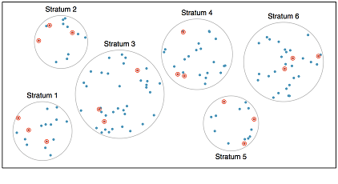
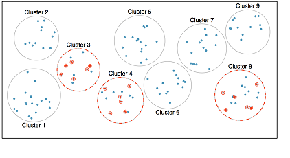




```{webr}
#| edit: false
#| output: false
#| define:
#|   - ok_response

library(htmltools)
ok_response <- function(response, n) {
  if (is.na(response)) HTML("")
  else if (response == n) div(HTML("Correct ✓"), style = "color: green")
  else div(HTML("Incorrect ✗"), style = "color: red")
}
```

```{webr}
#| edit: false
#| output: false
#| define:
#|   - ok_checkbox

ok_checkbox <- function(response, n) {
  if (is.na(response)) HTML("")
  else if (response == n) div(HTML("Correct ✓"), style = "color: green")
  else div(HTML("Not Yet! ✗"), style = "color: red")
}
```

```{webr}
#| edit: false
#| output: false
#| define:
#|   - normalize_checkbox_response

normalize_checkbox_response <- function(x) {
  return(cat(sort(x), sep = ","))
}
```

```{r}
#| label: global-options
#| include: false

library(dplyr)
library(ggplot2)
library(gradethis)
library(openintro)
library(kableExtra)
library(patchwork)
library(scales)

theme_set(theme_bw(base_size = 18))

set.seed(42)

houses <- read.csv("https://raw.githubusercontent.com/NikhilKumarMutyala/Linear-Regression-from-scartch-on-KC-House-Dataset/master/kc_house_data.csv")

houses <- houses %>%
  mutate(
    exterior = sample(c("brick", "vinyl siding", "shingles", "NA"), 
                      prob = c(0.15, 0.7, 0.12, 0.03),
                      size = n(), replace = TRUE),
    month = sample(1:12, size = n(), replace = TRUE)
  )

housesSubset <- houses %>%
  select(id, month, price, sqft_living, sqft_lot, waterfront, exterior)
```

## Data and Sampling

This is the first of a series of interactive workbooks you'll use to engage content from introductory statistics. This workbook covers an introduction to data, including some background on experimental design and data collection.

## An Introduction to Data

In this workbook you'll encounter two datasets -- one concerning real estate from King County, WA (`houses`) and another containing prices and attributes of almost 54,000 diamonds (`diamonds`). A few rows of the `houses` data is shown below in a convenient form where the rows of data represent *records* (sometimes called **observations**), and the columns represent **variables** (sometimes called **features**). We'll see later in our course that such data is called *tidy*.

```{r}
#| label: show data
#| exercise: false
#| echo: false

housesSubset %>%
  head(n = 10) %>%
  kable() %>%
  kable_styling(bootstrap_options = c("striped", "hover"))
```

You can see the first six rows of the dataset above. A simplified *data dictionary* (a map of column names and explanations) appears below.

+ `id` provides the property identification number.
+ `month` gives the month that the property was listed for sale.
+ `price` is the listing price of the property in US dollars (\$).
+ `sqft_living` gives the finished square footage of the home.
+ `sqft_lot` gives the square footage of the property (land).
+ `waterfront` indicates whether the property is waterfront.
+ `exterior` provides a description of the exterior covering of the home.


## Variable Types

Variables which take on numerical values <u>and</u> for which measures such as the mean, median, or standard deviation are meaningful are referred to as **numerical**. Variables which serve to group data into categories are called **categorical** --  examples include the color of a car or an area code prefix for a telephone number. Note that a telephone area code looks numeric, but since taking their average is meaningless, we consider it to be categorical. It is possible for data to be neither numerical nor categorical -- for example, a **unique identifier** is a non-numeric variable which is unique to each record. A timestamp may be an example of a unique identifier -- all is not lost, however, with a bit of pre-processing we can sometimes extract useful information from these columns.

Answer the following using your knowledge of the dataset and variable types.


:::{.callout-caution}
## Check Your Understanding: Numerical Variables

Check off each of the variables from the `houses` data set which are numerical.

```{ojs}
//| echo: false

mutable ok_checkbox = (response, n) => { return html`Loading...` };
viewof q1 = Inputs.checkbox(
  new Map([
    ["id", 1],
    ["month", 2],
    ["price", 3],
    ["sqft_living", 4],
    ["sqft_lot", 5],
    ["waterfront", 6],
    ["exterior", 7]
  ])
);

ok_checkbox(q1.toString(), "3,4,5");
```

:::

:::{.callout-caution}
## Check Your Understanding: Categorical Variables

Check off each of the variables from the `houses` dataset which are categorical.

```{ojs}
//| echo: false

//mutable ok_checkbox = (response, n) => { return html`Loading...` };
viewof q2 = Inputs.checkbox(
  new Map([
    ["id", 1],
    ["month", 2],
    ["price", 3],
    ["sqft_living", 4],
    ["sqft_lot", 5],
    ["waterfront", 6],
    ["exterior", 7]
  ])
);

ok_checkbox(q2.toString(), "2,6,7");
```

:::

:::{.callout-caution}
## Check Your Understanding: Unique Identifiers

Check off each of the variables from the `houses` dataset which are unique identifiers.

```{ojs}
//| echo: false

//mutable ok_checkbox = (response, n) => { return html`Loading...` };
viewof q3 = Inputs.checkbox(
  new Map([
    ["id", 1],
    ["month", 2],
    ["price", 3],
    ["sqft_living", 4],
    ["sqft_lot", 5],
    ["waterfront", 6],
    ["exterior", 7]
  ])
);

ok_checkbox(q3.toString(), "1");
```

:::

The **levels** of a variable are the different (unique) values that the variable takes on. For example, a dataset on students might include a variable called `ClassYear` with the levels *Freshman*, *Sophomore*, *Junior*, *Senior*. Numerical variables also have levels -- usually there are lots of levels corresponding to a numerical variable, but if there are too few, we may be better off considering the corresponding variable to be categorical. For example, if we had a dataset that included a `Year` variable, but its only observed levels in the dataset are 2008 and 2017, we may be better off thinking about `Year` as a categorical variable than as a numerical one.

## Relationships between variables

**Association, Independence, Correlation:** Two variables are *associated* with one another if a change in levels of one is generally accompanied by change in the other. That is, larger values of one variable are accompanied by larger (or smaller) values in the other. Think – does knowing something about one of the variables give me any information about the other? If two variables are not associated, then we might say that they are *independent* of one another. Lastly, *correlation* is a way to formally measure the strength of a <u>LINEAR</u> association between two variables. Look at the plots considering characteristics of various diamonds below.

###

```{r}
#| label: plots-associatons-num
#| echo: false
#| eval: true
#| results: false

p1 <- diamonds %>% 
  ggplot() + 
  geom_point(aes(x = carat, y = price), 
             color = "blue", alpha = .15) + 
  labs(
    title = "Price by Carat", 
    x = "Carat", 
    y = "Price"
    ) + 
  theme_bw(base_size = 12)

p2 <- diamonds %>%
  ggplot() + 
  geom_point(aes(x = carat, y = depth), 
             color = "blue", alpha = .15) + 
  labs(
    title = "Carat by Depth", 
    x = "Depth", 
    y = "Carat"
    ) + 
  theme_bw(base_size = 12)

p3 <- diamonds %>%
  ggplot() + 
  geom_point(aes(x = x, y = y), 
             color = "blue", alpha = .15) + 
  labs(
    title = "Length by Width", 
    x = "Length (mm)", 
    y = "Width (mm)"
    ) + 
  theme_bw(base_size = 12)

(p1 + p2) / p3
```

Use the plots above to answer the following questions.

:::{.callout-caution}
## Check Your Understanding: Associations

Which of the plots above highlight an association between the corresponding variables?

```{ojs}
//| echo: false

//mutable ok_checkbox = (response, n) => { return html`Loading...` };
viewof q4 = Inputs.checkbox(
  new Map([
    ["Carat versus Price", 1],
    ["Depth versus Carat", 2],
    ["Length by Width", 3]
  ])
);

ok_checkbox(q4.toString(), "1,3");
```

:::

:::{.callout-caution}
## Check Your Understanding: Independence

Which pair of variables from the above plots is independent?

```{ojs}
//| echo: false

//mutable ok_response = (response, n) => { return html`Loading...` };
viewof q5 = Inputs.radio(
  new Map([
    ["Carat versus Price", 1],
    ["Depth versus Carat", 2],
    ["Length by Width", 3]
  ])
);

ok_response(q5, "2");
```

:::

:::{.callout-caution}
## Check Your Understanding: Correlation

Which of the plots shows the strongest correlation between the corresponding variables?

```{ojs}
//| echo: false

//mutable ok_response = (response, n) => { return html`Loading...` };
viewof q6 = Inputs.radio(
  new Map([
    ["Carat versus Price", 1],
    ["Depth versus Carat", 2],
    ["Length by Width", 3]
  ])
);

ok_response(q6, "3");
```

:::

Since both of the variables in each of the plots above are numerical, we can describe the direction of the association. Notice that there is a *positive* association in both of the plots you identified above, since an increase in one of the variables is generally accompanied by an increase in the other. If two numerical variables are associated but an increase in one is generally accompanied by a decrease in the other, we say that the association is *negative*. For those familiar with lines and slopes, the direction of the association corresponds to the sign on the slope of a line of "best fit" (which we will discuss at the end of our course).

We can also identify whether an association exists between variables when one or more are categorical. Consider the plots below which refer back to our `houses` dataset from earlier.

```{r}
#| label: plots-association-cat
#| echo: false
#| eval: true
#| message: false
#| warning: false
#| results: false

housesSubset <- housesSubset %>%
  mutate(
    waterfront = ifelse(waterfront == 1, "yes", "no")
  )

p4 <- housesSubset %>% 
  ggplot() + 
  geom_boxplot(mapping = aes(x = waterfront, y = price)) +
  labs(title = "Price by Waterfront", x = "Waterfront", y = "Price", group = "Waterfront") + 
  scale_y_log10(labels = scales::dollar_format()) + 
  theme_bw(base_size = 12)

p5 <- housesSubset %>% 
  ggplot() + 
  geom_bar(mapping = aes(x = waterfront, fill = exterior), position = "fill") + 
  labs(title = "Exterior Covering and Waterfront", x = "Waterfront", y = "Proportion") + 
  theme(legend.position = "below") + 
  theme_bw(base_size = 12)

p4 + p5
```

:::{.callout-caution}
## Check Your Understanding: Associations II

One of the plots above shows an association between the corresponding variables. Which one is it?

```{ojs}
//| echo: false

//mutable ok_response = (response, n) => { return html`Loading...` };
viewof q7 = Inputs.radio(
  new Map([
    ["Price by Waterfront Status", 1],
    ["Exterior Covering and Waterfront Status", 2]
  ])
);

ok_response(q7, "1");
```

:::

Check your answer against the correct response. What makes that answer the best choice? If you’re unsure, ask a question to a friend, mentor, or teacher and work it out together.

:::{.callout-tip}
## Major Questions In Statistics

Given groups with different characteristics (differing levels) regarding variable *X*, do they differ with respect to variable *Y*? 

For example, we might ask *is the average listing price of a waterfront home greater than the average listing price of a home which is not on the waterfront in King County, WA*. In this example, *X* is whether or not the home is on the waterfront and *Y* is the listing price of the home.

:::

We'll find that we can't just answer these questions by looking at plots involving some sample data. Why not?

## Data collection principles

**Population versus Sample**: In statistics, we almost always want to apply generalizations from a small sample to a large population -- you might think of this as a sort of *stereotyping*. The trick here is that for our assertions (generalizations) to be valid, our sample must be *representative of* our population.


:::{.callout-tip}
## Critical Takeaway

Results based off of a sample may only be generalized to a population for which that sample is representative.
:::

**Sampling Strategies**: There are many sampling techniques. We will focus on census, simple random sample, stratified sample, and convenience sample. 

::::{.columns}

:::{.column width=60%}
If we could sample every object in a population we would be taking a *census*. While census would give us certainty in an answer to a statistical question, it is not feasible to conduct a census due to phenomenon such as non-response and fluid populations.
:::

:::{.column width=40%}

```{r}
#| label: census
#| echo: false
#| eval: true

pop <- tibble(
  x = sample(1:100, 100, replace = TRUE), 
  y = sample(1:100, 100, replace = TRUE))

pop %>% 
  ggplot() + 
  geom_point(mapping = aes(x = x, y = y), 
             size = 3, color = "darkorange") +
  labs(
    title = "Census", 
    x = "Entire Population Sampled (orange)")
```

:::

::::

  <center> **Please Listen** to [this NPR story](http://www.npr.org/templates/story/story.php?storyId=125380052){target="_blank"}  which aired prior to the 2010 Census
</center>

::::{.columns}

:::{.column width=60%}

The *simple random sample* is the GOLD STANDARD in statistics. We randomly select some "large enough" number of individual items from the entire population and take measurements on our variables of interest. The advantage of the simple random sample is that we are likely to attain a sample of results that are representative of the entire population.

:::

:::{.column width=40%}

```{r}
#| label: simple-random-sample
#| echo: false
#| eval: true

pop$samp <- sample(0:1, 100, prob = c(0.9,0.10), replace = TRUE)
pop$samp <- as.factor(pop$samp)

pop %>% 
  ggplot() + 
  geom_point(mapping = aes(x = x, y = y, color = samp, size = samp)) +
  scale_color_manual(values = c("steelblue", "darkorange")) +
  scale_size_manual(values = c(2, 4)) +
  labs(
    title = "Simple Random Sample",
    x = "Sampled Observations (Orange) Unsampled (Blue)",
    y = "") +
  theme(legend.position = "None")
```

:::

::::

::::{.columns}

:::{.column width=60%}

The *stratified sample* is used to ensure that we include representatives of all groups within our sample. Stratified sampling is particularly useful in cases where the population is segmented (that is, there are clear groups which may potentially have different responses)

:::

:::{.column width=40%}



:::

::::

::::{.columns}

:::{.column width=60%}

The *cluster sample* is used when we can argue that there are many small "populations" that are truly representative of the larger population. The clustering method is typically used to reduce costs (financial or otherwise). From the collection of *clusters*, a random sample is selected and as many observations as possible are collected from within each of those chosen clusters.
  
A variation on clustering is called *two-stage* or *multi-stage* sampling. With this method, observations are first clustered and clusters are chosen at random. Second, within each of the chosen clusters a simple random sample is taken. Notice that this method occurs in two stages, as the name suggests.

:::

:::{.column width=40%}



:::

::::

The *convenience sample* is the most commonly used sampling method. Unfortunately, it is also the worst. When researchers sample from individuals they have "easy access" to, they are conducting a convenience sample. There are always hidden biases in these samples. [Here's a famous example](https://youtu.be/JwZo28RKdvU) in which the Literary Digest incorrectly predicted a landslide victory for Alf Landon over FDR in the 1936 US Presidential Election. In addition, much of the error in predicting the results of the 2016 presidential election may be attributable to convenience sampling.

## Experimental Design

**Experiment versus Observational Study**: Beyond just sampling, there are multiple methods for collecting data. We can just *observe* what happens naturally (without manipulating any conditions) or we can run an *experiment*. In experiments we manipulate one or more conditions, utilizing a control and treatment group(s). The advantage to an experiment is that we can infer cause and effect relationships (this is extremely important in medical studies), but in observational studies we can only discuss an association between variables.

**Predictor versus Response Variables**: Typically in statistics we will identify a question (a claim about a response variable) with respect to a population. We will take a representative sample of that population and collect observed responses as well as observations on other variables (perhaps age, level of formal education, political affiliation, etc). These additional variables are called *predictor variables*. In general, predictor variables are quantities which we expect *may be associated with* the response variable.

There's lots more to learn about experimental design, but it is beyond the scope of this notebook. You should read pages 32 through 35 of [OpenIntro Statistics, 4Ed](https://www.openintro.org/book/os/) as a starting point.

## Submit

:::{.callout-warning}

Grading function is not currently available for these web-based notebooks. If you would like to utilize grading functionality, then please use either the [Posit Cloud pre-built instance](https://posit.cloud/content/6328402) or [install the `{learnr}` notebooks locally](https://agmath.github.io/IntroductoryStatistics/AccessingInteractiveNotes.html).

:::

## Summary

**Summary**: Here's a quick summary of the most important ideas from this first notebook.

  * Data is stored in a table called a data frame. The rows of the data frame are observations and the columns are collected variables.
  * Within this introductory course, data is either numerical or categorical -- to determine type, ask "is the average of these observations meaningful?"
  * Two variables are associated if a change in one has some (even limited) predictive value about a change in the other.
  * There are many ways data can be collected, but in order to produce meaningful results we must use random sampling.
  * Results from a sample can be generalized only to a population for which that sample is representative.
