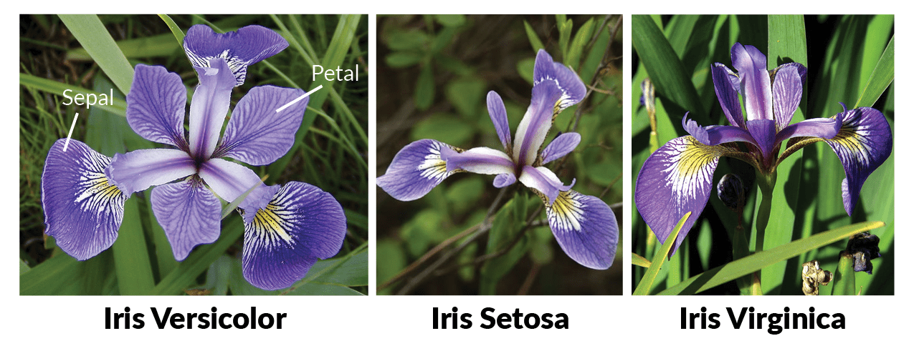




```{webr}
#| edit: false
#| output: false
#| define:
#|   - ok_response

library(htmltools)
ok_response <- function(response, n) {
  if (is.na(response)) div(HTML("You haven't answered yet."), style = "color: purple")
  else if (response == n) div(HTML("Correct ✓"), style = "color: green")
  else div(HTML("Incorrect ✗"), style = "color: red")
}
```

```{webr}
#| edit: false
#| output: false
#| define:
#|   - ok_checkbox

ok_checkbox <- function(response, n) {
  if (is.na(response)) div(HTML("You haven't answered yet."), style = "color: purple")
  else if (response == n) div(HTML("Correct ✓"), style = "color: green")
  else div(HTML("Not Yet! ✗"), style = "color: red")
}
```

```{webr}
#| context: setup
#| echo: false
#| output: false

library(dplyr)
library(ggplot2)
library(broom)

data(iris)

theme_set(theme_bw(base_size = 12))
```

```{r setup, include=FALSE}
library(dplyr)
library(ggplot2)
library(broom)

data(iris)

theme_set(theme_bw(base_size = 12))
```

:::{.callout-note}
## About

This activity introduces Analysis of Variance (ANOVA) for comparing means across more than two groups simultaneously. We'll test whether average petal width differs across three varieties of iris using the famous `iris` dataset collected by Anderson and published by Fisher. We'll also introduce the Tukey Honest Significant Differences test for pairwise follow-up comparisons.
:::

## ANalysis Of VAriance (ANOVA)

In this activity, we consider a method for comparing means from multiple groups. We'll use a very famous dataset containing measurements on three varieties of iris: *setosa*, *versicolor*, and *virginica*. Our goal is to determine whether the `iris` data provides significant evidence of a difference in average petal widths across the three varieties.

<center>

</center>

Notice that none of the tools we've encountered so far can be applied directly here. Our hypothesis testing strategies have been limited to comparing numerical measures across one or two populations. We could apply three separate one-versus-one tests (versicolor vs. setosa, versicolor vs. virginica, and setosa vs. virginica), but the probability of an erroneous conclusion grows quickly. At a 5% significance level, the probability of making at least one Type I error across three comparisons is $1 - (0.95)^3 \approx 14.26\%$. A better option is **ANalysis Of VAriance** — an ANOVA test.

Watch the video below from Dr. Çetinkaya-Rundel introducing ANOVA.

```{=html}
<center>
<iframe width="560" height="315" src="https://www.youtube.com/embed/W36DMVJ4Ibo" frameborder="0" allow="accelerometer; autoplay; encrypted-media; gyroscope; picture-in-picture" allowfullscreen></iframe>
</center>
```

Dr. Çetinkaya-Rundel's video walked through the details of ANOVA. The key ideas to carry forward are:

+ ANOVA tests whether there is significant evidence of a difference in means across **three or more** populations.
+ The test statistic follows an **$F$-distribution** rather than the normal or $t$-distribution.
+ The $p$-value is the area from the computed $F$-statistic into the **upper tail** of the $F$-distribution.
+ The interpretation of the $p$-value is the same as always — the probability of observing a sample at least as extreme as ours, assuming the null hypothesis is true.

Use the code block below to explore the `iris` dataset as you answer the questions that follow.

```{webr}
#| exercise: quiz-anova-playground
# Explore the iris dataset

```

:::{.hint exercise="quiz-anova-playground"}
:::{.callout-note collapse="false"}
## Hint 1

As we've done with previous datasets, you can call the name of the data frame or pipe it into functions like `head()`, `dim()`, or `glimpse()`.

:::
:::

:::{.callout-caution}
## Check Your Understanding: ANOVA I

Which of the following are the correct hypotheses for testing whether average petal widths differ across the three iris varieties?

```{ojs}
//| echo: false

mutable ok_response = (response, n) => { return html`Loading...` };
viewof q1 = Inputs.radio(
  new Map([
    ["H₀: μ_setosa = μ_versicolor = μ_virginica; Hₐ: At least one variety has a different average petal width.", 1],
    ["H₀: μ_setosa = μ_versicolor = μ_virginica; Hₐ: All varieties have different average petal widths.", 2],
    ["H₀: μ_setosa = μ_versicolor = μ_virginica; Hₐ: μ_setosa ≠ μ_versicolor ≠ μ_virginica", 3],
    ["H₀: μ_setosa = μ_versicolor = μ_virginica = 0; Hₐ: μ_setosa ≠ μ_versicolor ≠ μ_virginica ≠ 0", 4]
  ]),
  {value: JSON.parse(localStorage.getItem("q1") ?? "null")}
);

localStorage.setItem("q1", JSON.stringify(q1));
ok_response(q1, "1");
```

:::

:::{.callout-caution}
## Check Your Understanding: ANOVA II

How many groups are involved in this hypothesis test?

```{ojs}
//| echo: false

viewof q2 = Inputs.radio(
  new Map([
    ["1", 1],
    ["2", 2],
    ["3", 3],
    ["4", 4]
  ]),
  {value: JSON.parse(localStorage.getItem("q2") ?? "null")}
);

localStorage.setItem("q2", JSON.stringify(q2));
ok_response(q2, "3");
```

:::

:::{.callout-caution}
## Check Your Understanding: ANOVA III

How many degrees of freedom are due to groups?

```{ojs}
//| echo: false

viewof q3 = Inputs.radio(
  new Map([
    ["1", 1],
    ["2", 2],
    ["3", 3],
    ["4", 4]
  ]),
  {value: JSON.parse(localStorage.getItem("q3") ?? "null")}
);

localStorage.setItem("q3", JSON.stringify(q3));
ok_response(q3, "2");
```

:::

:::{.callout-caution}
## Check Your Understanding: ANOVA IV

Use the code block above to find the number of observations in `iris`. What are the total degrees of freedom?

```{ojs}
//| echo: false

viewof q4 = Inputs.radio(
  new Map([
    ["99", 1],
    ["100", 2],
    ["149", 3],
    ["150", 4],
    ["2", 5],
    ["3", 6]
  ]),
  {value: JSON.parse(localStorage.getItem("q4") ?? "null")}
);

localStorage.setItem("q4", JSON.stringify(q4));
ok_response(q4, "3");
```

:::

## Running an ANOVA Test in R

Dr. Çetinkaya-Rundel mentions in the video that ANOVA computations are tedious and prone to error — so we use software. In R, the `aov()` function runs an ANOVA test. Store the result of running `aov(Petal.Width ~ Species, data = iris)` in an object called `ANOVAtable`, then view the results by passing that object to `summary()`.

```{webr}
#| exercise: run-anova
______
```

:::{.hint exercise="run-anova"}
:::{.callout-note collapse="false"}
## Hint 1

Use the assignment arrow `<-` to store the result of `aov()` into `ANOVAtable`.

```{r}
#| echo: true
#| eval: false

ANOVAtable <- ___
```

:::
:::

:::{.hint exercise="run-anova"}
:::{.callout-note collapse="false"}
## Hint 2

Now pass `ANOVAtable` to `summary()` to view the ANOVA table.

```{r}
#| echo: true
#| eval: false

ANOVAtable <- aov(Petal.Width ~ Species, data = iris)
summary(___)
```

:::
:::

:::{.hint exercise="run-anova"}
:::{.callout-note collapse="false"}
## Hint 3 (Solved)

```{r}
#| echo: true
#| eval: false

ANOVAtable <- aov(Petal.Width ~ Species, data = iris)
summary(ANOVAtable)
```

:::
:::

```{webr}
#| exercise: run-anova
#| solution: true

ANOVAtable <- aov(Petal.Width ~ Species, data = iris)
summary(ANOVAtable)
```

```{webr}
#| exercise: run-anova
#| check: true

gradethis::grade_this({
  expected <- summary(aov(Petal.Width ~ Species, data = iris))
  if (identical(.result, expected)) {
    pass(random_praise())
  }
  fail(random_encouragement())
})
```

Use the output to answer the following questions.

:::{.callout-caution}
## Check Your Understanding: ANOVA Table I

How are the `Mean Sq` values related to the other values in the ANOVA table?

```{ojs}
//| echo: false

viewof q5 = Inputs.radio(
  new Map([
    ["Mean Sq is obtained by dividing Sum Sq (sum of squared deviations) by Df (degrees of freedom).", 1],
    ["Mean Sq is the F value divided by Sum Sq.", 2],
    ["Mean Sq values are unrelated to the other entries and are output as standalone meaningful values.", 3],
    ["Mean Sq values are the product of the F value and the p-value.", 4]
  ]),
  {value: JSON.parse(localStorage.getItem("q5") ?? "null")}
);

localStorage.setItem("q5", JSON.stringify(q5));
ok_response(q5, "1");
```

:::

:::{.callout-caution}
## Check Your Understanding: ANOVA Table II

What is the test statistic associated with this ANOVA test?

```{ojs}
//| echo: false

viewof q6 = Inputs.radio(
  new Map([
    ["2e-16", 1],
    ["40.21", 2],
    ["960", 3],
    ["2 and 147", 4],
    ["There is no test statistic associated with an ANOVA test.", 5]
  ]),
  {value: JSON.parse(localStorage.getItem("q6") ?? "null")}
);

localStorage.setItem("q6", JSON.stringify(q6));
ok_response(q6, "3");
```

:::

:::{.callout-caution}
## Check Your Understanding: ANOVA Table III

What is the $p$-value associated with this ANOVA test?

```{ojs}
//| echo: false

viewof q7 = Inputs.radio(
  new Map([
    ["0.05", 1],
    ["0.10", 2],
    ["0.04", 3],
    ["A number smaller than 0.0000000000000002", 4],
    ["-14", 5]
  ]),
  {value: JSON.parse(localStorage.getItem("q7") ?? "null")}
);

localStorage.setItem("q7", JSON.stringify(q7));
ok_response(q7, "4");
```

:::

:::{.callout-caution}
## Check Your Understanding: ANOVA Table IV

What is the conclusion of the test?

```{ojs}
//| echo: false

viewof q8 = Inputs.radio(
  new Map([
    ["Since p < α, we reject the null hypothesis and accept the alternative.", 1],
    ["Since p < α, we fail to reject the null hypothesis.", 2],
    ["Since p < α, we accept the null hypothesis.", 3],
    ["Since p ≥ α, we fail to reject the null hypothesis.", 4]
  ]),
  {value: JSON.parse(localStorage.getItem("q8") ?? "null")}
);

localStorage.setItem("q8", JSON.stringify(q8));
ok_response(q8, "1");
```

:::

:::{.callout-caution}
## Check Your Understanding: ANOVA Table V

What does the conclusion mean in the context of our original question?

```{ojs}
//| echo: false

viewof q9 = Inputs.radio(
  new Map([
    ["The iris data provides significant evidence to suggest that the average petal width is not the same across all three varieties.", 1],
    ["The iris data provides significant evidence to suggest that the average petal width is the same across all three varieties.", 2],
    ["The iris data does not provide significant evidence to suggest that average petal width differs across at least one variety.", 3],
    ["The iris data provides significant evidence to suggest that all three varieties have different average petal widths.", 4]
  ]),
  {value: JSON.parse(localStorage.getItem("q9") ?? "null")}
);

localStorage.setItem("q9", JSON.stringify(q9));
ok_response(q9, "1");
```

:::

## The Tukey Test

The ANOVA result tells us that *at least one variety has a different average petal width* — but it doesn't tell us which one. The **Tukey Honest Significant Differences (HSD) Test** can fill that gap. When ANOVA returns a significant result, the Tukey Test runs a collection of pairwise comparisons with adjusted $p$-values that account for the multiple comparisons being made.

Since our ANOVA was significant, we'll follow up with a Tukey Test. In R, we pass the result of `aov()` directly to `TukeyHSD()`. Run the code block below and use the output to answer the question that follows.

```{webr}
#| exercise: tukey

ANOVAtable <- aov(Petal.Width ~ Species, data = iris)
TukeyHSD(ANOVAtable)
```

:::{.callout-caution}
## Check Your Understanding: Tukey Test

Which pairs of iris varieties have significantly different average petal widths? Select all that apply.

```{ojs}
//| echo: false

mutable ok_checkbox = (response, n) => { return html`Loading...` };
viewof q10 = Inputs.checkbox(
  new Map([
    ["Versicolor and Setosa", 1],
    ["Virginica and Setosa", 2],
    ["Virginica and Versicolor", 3]
  ]),
  {value: JSON.parse(localStorage.getItem("q10") ?? "[]")}
);

localStorage.setItem("q10", JSON.stringify(q10));
ok_checkbox(q10.toString(), "1,2,3");
```

:::

You may have used the adjusted $p$-value column to make your decisions, or you may have noticed that none of the confidence intervals contain 0 — either way leads to the same conclusion. We can also visualize these confidence intervals directly. Run the code block below to produce a plot of the pairwise differences and their confidence intervals.

```{webr}
#| exercise: tukey-plot

ANOVAtable <- aov(Petal.Width ~ Species, data = iris)

TukeyHSD(ANOVAtable) |>
  tidy() |>
  ggplot() +
  geom_point(aes(x = estimate, y = contrast, color = contrast)) +
  geom_errorbarh(aes(
    xmin = conf.low,
    xmax = conf.high,
    y = contrast,
    color = contrast
  )) +
  geom_vline(xintercept = 0, linetype = "dashed", linewidth = 1.5) +
  labs(
    title = "Confidence Intervals for Pairwise Petal Width Differences",
    x = "Estimated Difference in Average Petal Widths (cm)",
    y = ""
  ) +
  theme(legend.position = "none")
```

The dashed vertical line at zero represents no difference. Since all three confidence intervals fall entirely to one side of zero, we have visual confirmation that each pair of varieties differs significantly in average petal width.

Which do you find more useful for communicating the results — the table, the plot, or a combination of both?

## Submit

:::{.callout-warning}

Grading function is not currently available for these web-based notebooks. If you would like to utilize grading functionality, please use either the [Posit Cloud pre-built instance](https://posit.cloud/content/6328402){target="_blank"} or [install the `{learnr}` notebooks locally](https://agmath.github.io/IntroductoryStatistics/AccessingInteractiveNotes.html){target="_blank"}.

:::

## Summary

:::{.callout-tip}
## Main Takeaways

+ **ANOVA** tests whether there is significant evidence of a difference in means across three or more populations. The null hypothesis states that all group means are equal; the alternative states that at least one differs.
+ **The $F$-statistic** is the test statistic for ANOVA. It measures the ratio of variation between groups to variation within groups — a large $F$ value suggests the group means are more spread out than would be expected by chance alone.
+ **The $p$-value** from an ANOVA test is the upper tail area of the $F$-distribution beyond the observed $F$-statistic. Its interpretation is exactly the same as in our earlier hypothesis tests.
+ **Running ANOVA in R** uses `aov(response ~ group, data = df)` followed by `summary()` to view the table.
+ **ANOVA only tells you that at least one group mean differs** — it does not identify which pair(s). A **Tukey HSD Test**, run via `TukeyHSD()`, performs all pairwise comparisons with adjusted $p$-values and should be used as a follow-up when ANOVA is significant.
+ **Why not just run multiple $t$-tests?** Each additional test inflates the probability of at least one false positive. With three groups and $\alpha = 0.05$, running all pairwise $t$-tests gives a $1 - 0.95^3 \approx 14\%$ chance of at least one erroneous conclusion. ANOVA and the Tukey correction keep that risk controlled.
:::

:::{.callout-tip}
## Looking Ahead

The final activity in this series is a regression lab. We'll shift from comparing group means to modeling the relationship between two numerical variables — using one to predict the other. Linear regression extends the inference framework you've built throughout this course into a new and widely-used context.
:::
